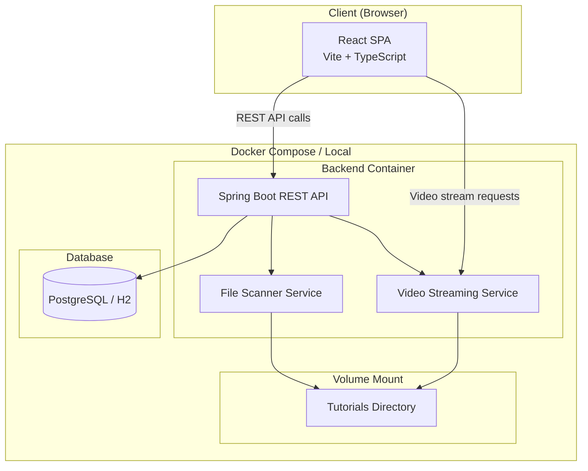
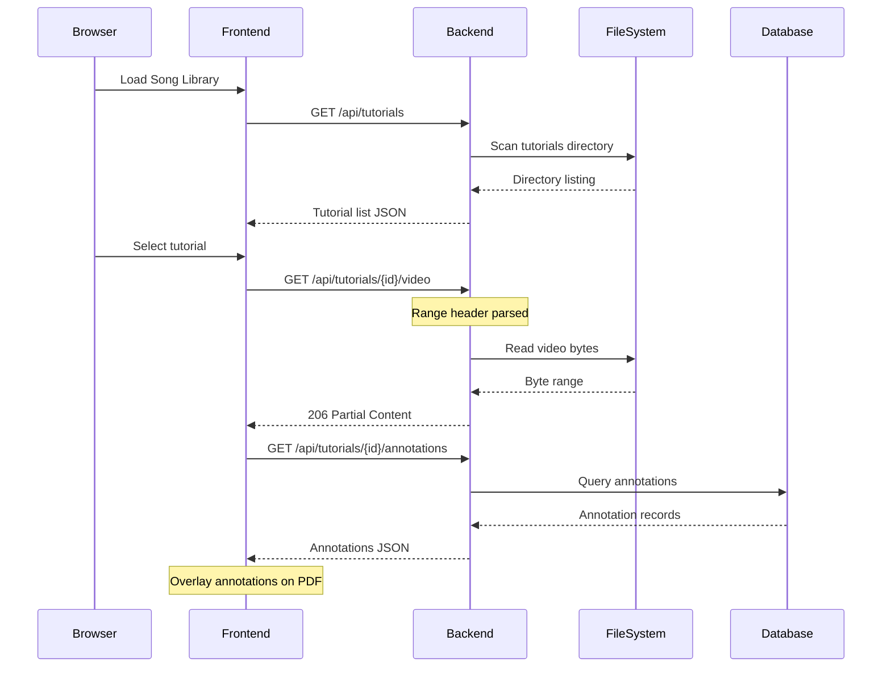
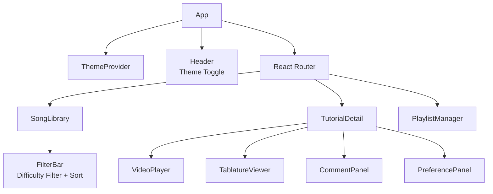
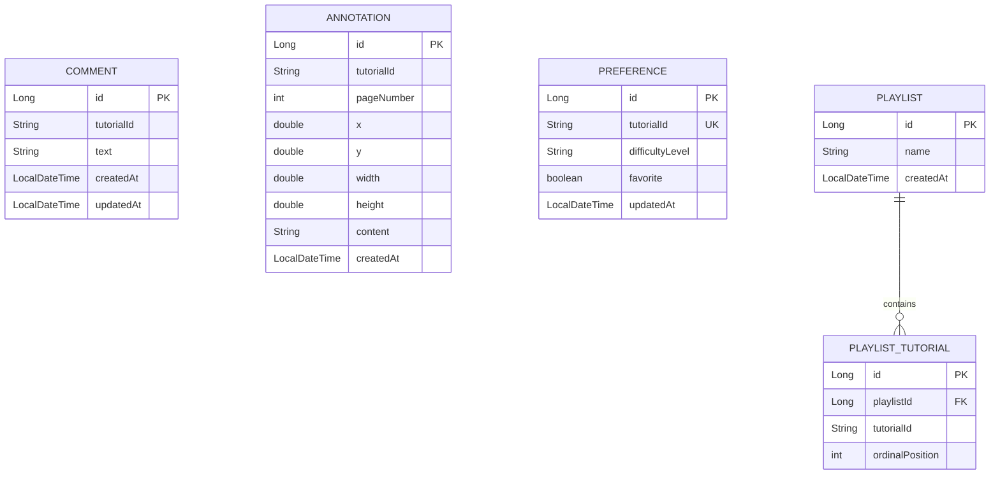

# Design Document: Guitar Tutorial Manager

## Overview

Guitar Tutorial Manager is a full-stack web application for managing a personal guitar tutorial library. The system consists of a Spring Boot backend that scans a configurable tutorials directory, streams video content via HTTP range requests, and persists user data (comments, annotations, preferences, playlists) in a relational database. The frontend is a Vite React TypeScript SPA that renders video playback with subtitle support, PDF tablature viewing with annotation capabilities, and a responsive Song Library interface with dark mode.

The architecture follows a classic client-server model: the React frontend communicates with the Spring Boot backend exclusively through a REST API. The backend owns all data persistence and file access. The frontend owns all rendering, annotation overlay, and PDF export logic. Deployment targets a Synology NAS DS918+ (amd64) via Docker Compose, with a local macOS development path that requires no Docker.

### Key Design Decisions

1. **Spring MVC over WebFlux**: The application serves a single user on a NAS. Spring MVC with `ResourceRegion` provides straightforward HTTP range request support without the complexity of reactive streams.
2. **Filesystem scanning on demand**: The backend scans the tutorials directory on each Song Library request rather than maintaining a persistent file index. This keeps the system simple and always reflects the current directory state.
3. **Annotation storage split**: Annotation metadata (position, content, page) is persisted in the database. The frontend uses pdf-lib to render annotations as overlays on the react-pdf canvas and to bake them into downloaded PDFs. The original PDF files are never modified.
4. **Single-user model**: No authentication or multi-user support. All data belongs to a single implicit user.
5. **H2 for local, PostgreSQL for production**: Spring profiles (`local`, `prod`) switch the datasource. JPA with Hibernate DDL auto-update handles schema management for both.

## Architecture

### System Architecture Diagram



### Request Flow



### Deployment Profiles

| Profile | Database | Tutorials Directory | How to Run |
|---------|----------|-------------------|------------|
| `local` | H2 (in-memory) | Local filesystem path | `./mvnw spring-boot:run` + `npm run dev` |
| `dev` (Docker) | H2 (in-memory) | Docker volume mount | `docker compose --profile dev up` |
| `prod` (Docker) | PostgreSQL container | Docker volume mount | `docker compose up` |

## Components and Interfaces

### Backend Components

#### 1. TutorialScannerService

Scans the configured tutorials directory and builds a list of available tutorials.

```java
@Service
public class TutorialScannerService {
    // Scans tutorialsDirectory for subdirectories containing at least one video file.
    // Returns a list of TutorialInfo DTOs with metadata about available files.
    List<TutorialInfo> scanTutorials();

    // Returns file metadata for a single tutorial by directory name.
    Optional<TutorialInfo> getTutorial(String directoryName);
}
```

**Rules:**
- A valid tutorial subdirectory must contain at least one video file (`.mp4`, `.mkv`, `.webm`, `.avi`).
- Subdirectories with no video file are excluded.
- Subtitle availability is determined by the presence of an `.srt` file.
- Tablature availability is determined by the presence of a `.pdf` file.
- The directory name serves as the tutorial identifier.

#### 2. VideoStreamingService

Handles HTTP range request logic for video file streaming.

```java
@Service
public class VideoStreamingService {
    // Returns a ResourceRegion for the requested byte range of the video file.
    // Supports Range header parsing for partial content delivery.
    ResourceRegion getVideoRegion(String tutorialId, HttpHeaders headers) throws IOException;

    // Returns the subtitle file content for a tutorial, if available.
    Optional<Resource> getSubtitleFile(String tutorialId);
}
```

**Implementation approach:** Uses Spring's `ResourceRegion` with `ResourceHttpRequestHandler` semantics. The controller returns `ResponseEntity<ResourceRegion>` with status 206 (Partial Content) when a Range header is present, or streams the full file otherwise. Chunk size is capped at 1MB per range request to manage memory on the NAS.

#### 3. REST Controllers

| Controller | Base Path | Responsibility |
|-----------|-----------|---------------|
| `TutorialController` | `/api/tutorials` | Tutorial listing, video streaming, subtitle/tablature file serving |
| `CommentController` | `/api/tutorials/{tutorialId}/comments` | CRUD for comments on a tutorial |
| `AnnotationController` | `/api/tutorials/{tutorialId}/annotations` | CRUD for PDF annotations |
| `PreferenceController` | `/api/tutorials/{tutorialId}/preferences` | Read/write tutorial preferences |
| `PlaylistController` | `/api/playlists` | Playlist CRUD and tutorial ordering |

#### 4. REST API Endpoints

**Tutorials**
| Method | Path | Description |
|--------|------|-------------|
| `GET` | `/api/tutorials` | List all tutorials with file metadata |
| `GET` | `/api/tutorials/{id}` | Get single tutorial details |
| `GET` | `/api/tutorials/{id}/video` | Stream video (supports Range header) |
| `GET` | `/api/tutorials/{id}/subtitle` | Get SRT subtitle file |
| `GET` | `/api/tutorials/{id}/tablature` | Get PDF tablature file |

**Comments**
| Method | Path | Description |
|--------|------|-------------|
| `GET` | `/api/tutorials/{id}/comments` | List comments (ordered by createdAt desc) |
| `POST` | `/api/tutorials/{id}/comments` | Create comment |
| `PUT` | `/api/tutorials/{id}/comments/{commentId}` | Update comment |
| `DELETE` | `/api/tutorials/{id}/comments/{commentId}` | Delete comment |

**Annotations**
| Method | Path | Description |
|--------|------|-------------|
| `GET` | `/api/tutorials/{id}/annotations` | List annotations for tutorial's tablature |
| `POST` | `/api/tutorials/{id}/annotations` | Create annotation |
| `PUT` | `/api/tutorials/{id}/annotations/{annotationId}` | Update annotation |
| `DELETE` | `/api/tutorials/{id}/annotations/{annotationId}` | Delete annotation |

**Preferences**
| Method | Path | Description |
|--------|------|-------------|
| `GET` | `/api/tutorials/{id}/preferences` | Get preferences for tutorial |
| `PUT` | `/api/tutorials/{id}/preferences` | Create or update preferences |

**Playlists**
| Method | Path | Description |
|--------|------|-------------|
| `GET` | `/api/playlists` | List all playlists |
| `POST` | `/api/playlists` | Create playlist |
| `GET` | `/api/playlists/{id}` | Get playlist with ordered tutorials |
| `PUT` | `/api/playlists/{id}` | Update playlist name |
| `DELETE` | `/api/playlists/{id}` | Delete playlist and associations |
| `POST` | `/api/playlists/{id}/tutorials` | Add tutorial to playlist |
| `PUT` | `/api/playlists/{id}/tutorials` | Reorder tutorials in playlist |
| `DELETE` | `/api/playlists/{id}/tutorials/{tutorialId}` | Remove tutorial from playlist |

### Frontend Components

#### 1. SongLibrary

The main browsable view displaying all tutorials as a table of contents.

- Fetches tutorial list from `GET /api/tutorials`
- Displays tutorial name, subtitle availability icon, tablature availability icon, and difficulty level
- Supports filtering by difficulty level and sorting columns
- Shows "No tutorials available" message when the list is empty
- Clicking a tutorial navigates to the TutorialDetail view

#### 2. TutorialDetail

The detail view for a selected tutorial, containing the video player, tablature viewer, and comments panel.

- Layout adapts based on available content (video only, video + tablature, etc.)
- Contains VideoPlayer, TablatureViewer, and CommentPanel as child components

#### 3. VideoPlayer

Renders the HTML5 `<video>` element with streaming support.

- Sets video `src` to the backend streaming endpoint
- Browser natively handles Range requests for seeking
- Loads SRT subtitle as a `<track>` element when available
- Hides subtitle controls when no SRT file exists

#### 4. TablatureViewer

Renders PDF tablatures with annotation overlay support.

- Uses `react-pdf` `<Document>` and `<Page>` components to render the PDF
- Renders a transparent annotation overlay layer on top of each page
- Annotations are positioned absolutely based on stored coordinates (x, y, width, height, page)
- Click-to-add: user clicks on the PDF to place a new annotation at that position
- Annotation editing: click an existing annotation to edit its text content
- Uses `pdf-lib` and `file-saver` for the download function that bakes annotations into a new PDF

#### 5. CommentPanel

Displays and manages comments for a tutorial.

- Lists comments ordered by creation date (newest first)
- Provides a text input for adding new comments
- Each comment has edit and delete actions
- Validates that comment text is non-empty before submission

#### 6. PreferencePanel

Manages tutorial-level preferences.

- Difficulty level selector (e.g., Beginner, Intermediate, Advanced)
- Favorite toggle
- Persists changes immediately via PUT to the backend

#### 7. PlaylistManager

Manages playlist creation, viewing, and tutorial ordering.

- List view showing all playlists
- Detail view showing tutorials in a playlist with drag-to-reorder
- Add/remove tutorials from playlists
- Create/delete playlists with name validation

#### 8. ThemeProvider

Manages dark/light mode theming.

- Detects OS color scheme preference via `prefers-color-scheme` media query
- Provides a toggle button in the app header
- Stores user preference in localStorage
- Applies theme via CSS custom properties (no page reload)

### Frontend Component Tree



## Data Models

### Backend Entity Diagram



### JPA Entities

#### Comment

```java
@Entity
@Data @NoArgsConstructor @AllArgsConstructor @Builder
public class Comment {
    @Id @GeneratedValue(strategy = GenerationType.IDENTITY)
    private Long id;

    @Column(nullable = false)
    private String tutorialId;

    @Column(nullable = false, columnDefinition = "TEXT")
    private String text;

    @Column(nullable = false)
    private LocalDateTime createdAt;

    private LocalDateTime updatedAt;
}
```

#### Annotation

```java
@Entity
@Data @NoArgsConstructor @AllArgsConstructor @Builder
public class Annotation {
    @Id @GeneratedValue(strategy = GenerationType.IDENTITY)
    private Long id;

    @Column(nullable = false)
    private String tutorialId;

    @Column(nullable = false)
    private int pageNumber;

    @Column(nullable = false)
    private double x;

    @Column(nullable = false)
    private double y;

    @Column(nullable = false)
    private double width;

    @Column(nullable = false)
    private double height;

    @Column(columnDefinition = "TEXT")
    private String content;

    @Column(nullable = false)
    private LocalDateTime createdAt;
}
```

#### Preference

```java
@Entity
@Data @NoArgsConstructor @AllArgsConstructor @Builder
public class Preference {
    @Id @GeneratedValue(strategy = GenerationType.IDENTITY)
    private Long id;

    @Column(nullable = false, unique = true)
    private String tutorialId;

    private String difficultyLevel;

    @Column(nullable = false)
    private boolean favorite;

    private LocalDateTime updatedAt;
}
```

#### Playlist

```java
@Entity
@Data @NoArgsConstructor @AllArgsConstructor @Builder
public class Playlist {
    @Id @GeneratedValue(strategy = GenerationType.IDENTITY)
    private Long id;

    @Column(nullable = false)
    private String name;

    @Column(nullable = false)
    private LocalDateTime createdAt;

    @OneToMany(mappedBy = "playlist", cascade = CascadeType.ALL, orphanRemoval = true)
    @OrderBy("ordinalPosition ASC")
    private List<PlaylistTutorial> tutorials = new ArrayList<>();
}
```

#### PlaylistTutorial

```java
@Entity
@Data @NoArgsConstructor @AllArgsConstructor @Builder
public class PlaylistTutorial {
    @Id @GeneratedValue(strategy = GenerationType.IDENTITY)
    private Long id;

    @ManyToOne(fetch = FetchType.LAZY)
    @JoinColumn(name = "playlist_id", nullable = false)
    private Playlist playlist;

    @Column(nullable = false)
    private String tutorialId;

    @Column(nullable = false)
    private int ordinalPosition;
}
```

### DTOs

```java
// Returned by TutorialScannerService
public record TutorialInfo(
    String id,              // directory name
    String name,            // display name (derived from directory name)
    String videoFilename,
    boolean hasSubtitle,
    boolean hasTablature
) {}

// Comment request/response
public record CommentDto(
    Long id,
    String tutorialId,
    String text,
    LocalDateTime createdAt,
    LocalDateTime updatedAt
) {}

// Annotation request/response
public record AnnotationDto(
    Long id,
    String tutorialId,
    int pageNumber,
    double x,
    double y,
    double width,
    double height,
    String content,
    LocalDateTime createdAt
) {}

// Preference request/response
public record PreferenceDto(
    String tutorialId,
    String difficultyLevel,
    boolean favorite
) {}

// Playlist response (includes ordered tutorials)
public record PlaylistDto(
    Long id,
    String name,
    LocalDateTime createdAt,
    List<PlaylistTutorialDto> tutorials
) {}

public record PlaylistTutorialDto(
    String tutorialId,
    String tutorialName,
    int ordinalPosition
) {}
```

### Frontend TypeScript Interfaces

```typescript
interface Tutorial {
  id: string;
  name: string;
  videoFilename: string;
  hasSubtitle: boolean;
  hasTablature: boolean;
}

interface Comment {
  id: number;
  tutorialId: string;
  text: string;
  createdAt: string;
  updatedAt?: string;
}

interface Annotation {
  id: number;
  tutorialId: string;
  pageNumber: number;
  x: number;
  y: number;
  width: number;
  height: number;
  content: string;
  createdAt: string;
}

interface Preference {
  tutorialId: string;
  difficultyLevel: string;
  favorite: boolean;
}

interface Playlist {
  id: number;
  name: string;
  createdAt: string;
  tutorials: PlaylistTutorial[];
}

interface PlaylistTutorial {
  tutorialId: string;
  tutorialName: string;
  ordinalPosition: number;
}
```

### Configuration

**application.yml (common)**
```yaml
tutorials:
  directory: ${TUTORIALS_DIR:./tutorials}

spring:
  jpa:
    hibernate:
      ddl-auto: update
    open-in-view: false
```

**application-local.yml**
```yaml
spring:
  datasource:
    url: jdbc:h2:mem:guitardb
    driver-class-name: org.h2.Driver
  h2:
    console:
      enabled: true
```

**application-prod.yml**
```yaml
spring:
  datasource:
    url: jdbc:postgresql://${DB_HOST:db}:${DB_PORT:5432}/${DB_NAME:guitardb}
    username: ${DB_USER:guitar}
    password: ${DB_PASSWORD:guitar}
    driver-class-name: org.postgresql.Driver
```

### Docker Compose Configuration

```yaml
version: "3.8"

services:
  backend:
    build: ./backend
    ports:
      - "${BACKEND_PORT:-8080}:8080"
    environment:
      - SPRING_PROFILES_ACTIVE=prod
      - TUTORIALS_DIR=/tutorials
      - DB_HOST=db
      - DB_USER=${DB_USER:-guitar}
      - DB_PASSWORD=${DB_PASSWORD:-guitar}
    volumes:
      - ${TUTORIALS_PATH}:/tutorials:ro
    depends_on:
      - db

  frontend:
    build: ./frontend
    ports:
      - "${FRONTEND_PORT:-3000}:80"
    depends_on:
      - backend

  db:
    image: postgres:16-alpine
    environment:
      - POSTGRES_DB=${DB_NAME:-guitardb}
      - POSTGRES_USER=${DB_USER:-guitar}
      - POSTGRES_PASSWORD=${DB_PASSWORD:-guitar}
    volumes:
      - pgdata:/var/lib/postgresql/data

volumes:
  pgdata:
```

## Correctness Properties

*A property is a characteristic or behavior that should hold true across all valid executions of a system — essentially, a formal statement about what the system should do. Properties serve as the bridge between human-readable specifications and machine-verifiable correctness guarantees.*

### Property 1: Tutorial scanner correctness

*For any* tutorials directory containing a mix of subdirectories — some with video files (and optionally SRT/PDF files) and some without video files — the scanner SHALL return exactly those subdirectories that contain at least one video file, and each returned TutorialInfo SHALL accurately report the presence or absence of subtitle and tablature files.

**Validates: Requirements 1.1, 1.3**

### Property 2: Song Library renders required tutorial information

*For any* list of TutorialInfo objects, the SongLibrary component SHALL render each tutorial's name, subtitle availability indicator, and tablature availability indicator in the output.

**Validates: Requirements 1.2**

### Property 3: Video streaming range correctness

*For any* valid video file and any valid HTTP Range header specifying a byte range within the file's length, the VideoStreamingService SHALL return a ResourceRegion whose offset and length match the requested range, and the response content length SHALL not exceed the configured chunk size.

**Validates: Requirements 2.1**

### Property 4: Comment CRUD round-trip

*For any* valid tutorial ID and any non-empty comment text, creating a comment and then retrieving it SHALL return a comment with the same tutorial reference and text, a non-null createdAt timestamp, and — if subsequently updated with new text — the retrieved comment SHALL reflect the new text and have an updatedAt timestamp that is greater than or equal to createdAt.

**Validates: Requirements 3.1, 3.3**

### Property 5: Comment ordering invariant

*For any* set of comments associated with a tutorial, retrieving the comments SHALL return them ordered by createdAt descending, such that each comment's createdAt is greater than or equal to the next comment's createdAt in the list.

**Validates: Requirements 3.2**

### Property 6: Comment deletion invariant

*For any* comment that has been created and then deleted, querying comments for that tutorial SHALL not include the deleted comment, and the total count SHALL decrease by exactly one.

**Validates: Requirements 3.4**

### Property 7: Whitespace comment rejection

*For any* string composed entirely of whitespace characters (including empty string, spaces, tabs, and newlines), submitting it as a comment text SHALL be rejected with a validation error, and the set of comments for that tutorial SHALL remain unchanged.

**Validates: Requirements 3.5**

### Property 8: Annotation persistence round-trip

*For any* set of valid annotations (each with a tutorialId, pageNumber, x, y, width, height, and content), creating all of them and then querying annotations for that tutorial SHALL return all created annotations with their original field values preserved.

**Validates: Requirements 4.3, 4.4**

### Property 9: Annotation deletion invariant

*For any* annotation that has been created and then deleted, querying annotations for that tutorial SHALL not include the deleted annotation, and the total count SHALL decrease by exactly one.

**Validates: Requirements 4.5**

### Property 10: Preference upsert round-trip

*For any* valid tutorial ID and any valid difficulty level and favorite flag, setting the preference and then retrieving it SHALL return the same difficulty level and favorite value. If the preference is subsequently updated with different values, retrieving it SHALL return the new values.

**Validates: Requirements 5.1, 5.2**

### Property 11: Difficulty filter correctness

*For any* list of tutorials with assigned difficulty levels, filtering by a specific difficulty level SHALL return only tutorials whose difficulty level matches the filter value, and the result set SHALL be a subset of the original list.

**Validates: Requirements 5.4**

### Property 12: Playlist with tutorials round-trip

*For any* valid playlist name and any sequence of tutorial IDs added to the playlist, creating the playlist and adding the tutorials SHALL result in a playlist that, when retrieved, contains the same name, a non-null createdAt, and all added tutorials with ordinal positions forming a contiguous sequence starting from 0.

**Validates: Requirements 6.1, 6.2**

### Property 13: Playlist ordinal integrity after mutation

*For any* playlist containing N tutorials, after any single reorder or removal operation, the ordinal positions of the remaining tutorials SHALL form a contiguous sequence from 0 to (remaining count - 1) with no gaps or duplicates.

**Validates: Requirements 6.3, 6.4**

### Property 14: Playlist cascade deletion

*For any* playlist with associated tutorials, deleting the playlist SHALL remove both the playlist record and all associated PlaylistTutorial records from the database.

**Validates: Requirements 6.5**

### Property 15: Whitespace playlist name rejection

*For any* string composed entirely of whitespace characters (including empty string), creating a playlist with that name SHALL be rejected with a validation error, and no new playlist SHALL be persisted.

**Validates: Requirements 6.7**

## Error Handling

### Backend Error Handling Strategy

| Scenario | HTTP Status | Response Body |
|----------|-------------|---------------|
| Tutorial not found (invalid ID) | 404 | `{ "error": "Tutorial not found", "tutorialId": "..." }` |
| Video file missing from filesystem | 404 | `{ "error": "Video file not found", "tutorialId": "..." }` |
| Subtitle file not available | 404 | `{ "error": "No subtitle file for this tutorial" }` |
| Tablature file not available | 404 | `{ "error": "No tablature file for this tutorial" }` |
| Comment not found | 404 | `{ "error": "Comment not found", "commentId": ... }` |
| Annotation not found | 404 | `{ "error": "Annotation not found", "annotationId": ... }` |
| Playlist not found | 404 | `{ "error": "Playlist not found", "playlistId": ... }` |
| Empty comment text | 400 | `{ "error": "Comment text must not be blank" }` |
| Empty playlist name | 400 | `{ "error": "Playlist name must not be blank" }` |
| Invalid annotation coordinates | 400 | `{ "error": "Invalid annotation position" }` |
| Tutorials directory not accessible | 500 | `{ "error": "Tutorials directory is not accessible" }` |
| Database error | 500 | `{ "error": "Internal server error" }` |
| Invalid Range header | 416 | `{ "error": "Range not satisfiable" }` |

### Implementation

- A `@RestControllerAdvice` global exception handler maps domain exceptions to appropriate HTTP responses.
- Domain exceptions: `TutorialNotFoundException`, `ResourceNotFoundException`, `ValidationException`, `StorageAccessException`.
- All 4xx errors return a JSON body with an `error` field and relevant context fields.
- All 5xx errors return a generic message; details are logged server-side only.
- Validation uses Jakarta Bean Validation annotations (`@NotBlank`, `@NotNull`, `@Min`, `@Max`) on request DTOs.

### Frontend Error Handling

- API errors are caught by a centralized fetch wrapper / Axios interceptor.
- 404 errors display contextual "not found" messages in the relevant component.
- 400 errors display validation messages near the input that caused them.
- 500 errors display a generic "Something went wrong" toast notification.
- Network errors (offline, timeout) display a connection error banner.
- Video streaming errors fall back to the browser's native error UI for the `<video>` element.

## Testing Strategy

### Backend Testing

**Unit Tests (JUnit 5 + Mockito)**
- Service layer tests with mocked repositories and filesystem
- Controller tests using `@WebMvcTest` with mocked services
- Validation tests for request DTOs
- Edge cases: empty directories, missing files, invalid ranges, concurrent modifications

**Property-Based Tests (jqwik)**
- The project SHALL use [jqwik](https://jqwik.net/) as the property-based testing library for Java
- Each correctness property (Properties 1–15) SHALL be implemented as a jqwik `@Property` test
- Each property test SHALL run a minimum of 100 iterations
- Each property test SHALL be tagged with a comment: `Feature: guitar-tutorial-manager, Property {N}: {title}`
- Generators will produce random tutorial directory structures, comment texts, annotation coordinates, playlist orderings, and Range header values

**Integration Tests (Spring Boot Test)**
- `@SpringBootTest` tests with H2 for full request-response cycle
- Tests for video streaming with actual file I/O
- Tests for database cascade operations (playlist deletion)

### Frontend Testing

**Unit Tests (Vitest + React Testing Library)**
- Component rendering tests for SongLibrary, VideoPlayer, TablatureViewer, CommentPanel, PlaylistManager
- Theme toggle behavior
- Filter and sort logic
- Empty state rendering

**Property-Based Tests (fast-check)**
- The project SHALL use [fast-check](https://github.com/dubzzz/fast-check) as the property-based testing library for TypeScript
- Frontend properties (Properties 2, 11) SHALL be implemented as fast-check property tests
- Each property test SHALL run a minimum of 100 iterations
- Each property test SHALL be tagged with a comment: `Feature: guitar-tutorial-manager, Property {N}: {title}`

**Integration Tests**
- API integration tests with MSW (Mock Service Worker) for mocking backend responses
- PDF annotation workflow tests (create, render, download)

### Test Organization

```
backend/
  src/test/java/
    unit/          # Unit tests with mocks
    property/      # jqwik property-based tests
    integration/   # @SpringBootTest integration tests

frontend/
  src/__tests__/
    unit/          # Vitest + RTL component tests
    property/      # fast-check property tests
    integration/   # MSW-based API integration tests
```

