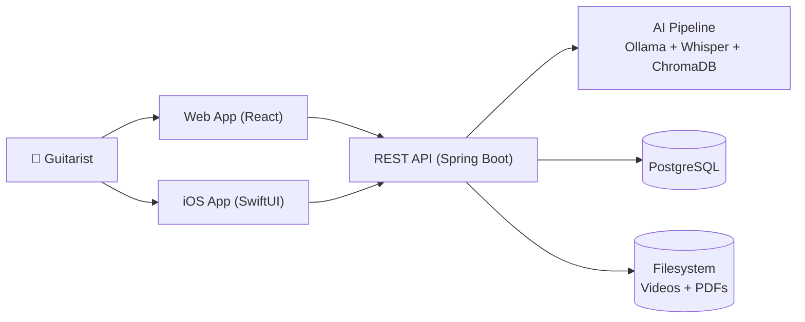

# Guitar Tutorial Manager

> Organise, annotate, and search your guitar tutorial collection with AI-powered metadata extraction and semantic search.

[](#)
[](https://www.java.com)
[](https://www.postgresql.org)
[](#)

---

## Overview

Guitar Tutorial Manager is a full-stack application that helps guitarists manage their collection of video-and-PDF tutorial files. Upload a lesson video with its tablature PDF, and the system automatically:

- Extracts structured metadata (title, tuning, key, difficulty, techniques, genre) using **Mistral/Ollama**
- Generates SRT subtitles from video audio using **Faster-Whisper**
- Indexes PDF text chunks into **ChromaDB** for semantic search
- Streams video with HTTP range requests for efficient playback



---

## Features

| Feature | Description |
|---------|-------------|
| 📚 **Library** | Browse all tutorials with filterable cards (difficulty, genre, tuning) |
| 🔍 **Semantic Search** | Natural-language search across all tutorial content via ChromaDB |
| 🎬 **Video Streaming** | Efficient chunked streaming with seeking and subtitle support |
| 📄 **PDF Viewer** | View tablature PDFs with annotations (text, highlight, underline, drawing) |
| 💬 **Comments** | Leave notes on tutorials |
| 📋 **Playlists** | Create ordered collections of tutorials |
| ⭐ **Favourites** | Mark tutorials and set difficulty levels |
| 🎨 **Themes** | Light/dark mode toggle |
| 🤖 **AI Metadata** | Automatic extraction of song attributes from PDFs |
| 📝 **Subtitles** | Auto-generated SRT from video audio |
| 📱 **iOS App** | Native SwiftUI companion app |

---

## Quick Start

### Prerequisites

- [Docker](https://docs.docker.com/get-docker/) & [Docker Compose](https://docs.docker.com/compose/install/)
- At least 8GB RAM (16GB recommended for AI services)

### Development (H2 Database)

```bash
cp .env.example .env
docker compose -f docker-compose.dev.yml up --build
```

Open **http://localhost:3000** in your browser.

### Production (PostgreSQL)

```bash
cp .env.example .env
# Edit .env with production values
docker compose up --build
```

---

## Project Structure

```
guitar-tutoma-ai/
├── backend/                          # Spring Boot 4 / Java 25
│   ├── src/main/java/.../
│   │   ├── controller/               # REST API controllers
│   │   ├── service/                  # Business logic & AI integration
│   │   ├── entity/                   # JPA entities
│   │   ├── dto/                      # Data transfer objects
│   │   ├── repository/               # Spring Data JPA repositories
│   │   └── exception/                # Custom exceptions
│   ├── scripts/                      # Python scripts (Whisper, Chroma, extraction)
│   ├── Dockerfile                    # Multi-stage build
│   ├── Dockerfile.chroma             # ChromaDB service
│   └── pom.xml
├── frontend/                         # React 18 + TypeScript + Vite
│   ├── src/
│   │   ├── pages/                    # Route pages
│   │   ├── components/               # Reusable UI components
│   │   ├── services/                 # API client
│   │   ├── context/                  # React context (theme)
│   │   └── types/                    # TypeScript type definitions
│   ├── nginx.conf                    # Production nginx config
│   └── package.json
├── ios/                              # iOS SwiftUI app
│   └── GuitarTutorial/
│       ├── Views/                    # SwiftUI views
│       ├── ViewModels/               # Observable view models
│       ├── Services/                 # API client, auth, keychain
│       └── Models/                   # Data models
├── docs/                             # Project documentation
│   ├── architecture-overview.md
│   ├── api-reference.md
│   ├── data-model.md
│   ├── deployment-guide.md
│   └── functional-documentation.md
├── docker-compose.yml                # Production stack
├── docker-compose.dev.yml            # Development stack (H2)
└── .env.example                      # Environment template
```

---

## Architecture

The system consists of **5 Docker services**:

| Service | Technology | Purpose |
|---------|-----------|---------|
| `frontend` | nginx + React SPA | Web UI |
| `backend` | Spring Boot 4 + Java 25 | REST API + business logic |
| `db` | PostgreSQL 16 | Relational data store |
| `ollama` | Ollama + Mistral | LLM for metadata extraction |
| `chroma` | ChromaDB (Python) | Vector database for semantic search |

For a detailed breakdown, see [`docs/architecture-overview.md`](docs/architecture-overview.md).

---

## API Overview

| Method | Endpoint | Description |
|--------|----------|-------------|
| `GET` | `/api/tutorials` | List all tutorials |
| `GET` | `/api/tutorials/{id}` | Get tutorial details |
| `GET` | `/api/tutorials/{id}/video` | Stream video (Range support) |
| `POST` | `/api/tutorials/create` | Create tutorial (auth) |
| `POST` | `/api/tutorials/{id}/pdf` | Upload PDF + extract metadata |
| `GET` | `/api/tutorials/{id}/metadata` | Get extracted metadata |
| `GET` | `/api/tutorials/search?q=...` | Semantic search |
| `GET/POST/PUT/DELETE` | `/api/tutorials/{id}/annotations` | Annotations CRUD |
| `GET/POST/PUT/DELETE` | `/api/tutorials/{id}/comments` | Comments CRUD |
| `GET/PUT` | `/api/tutorials/{id}/preferences` | Per-tutorial preferences |
| `GET/POST/PUT/DELETE` | `/api/playlists` | Playlists CRUD |
| `POST` | `/api/auth/register` | Register |
| `POST` | `/api/auth/login` | Login |
| `GET/PUT` | `/api/user/preferences` | User preferences (auth) |

Full API reference: [`docs/api-reference.md`](docs/api-reference.md)

---

## Data Model

```mermaid
erDiagram
    User {
        long id PK
        string username UK
        string email UK
        string passwordHash
    }

    UserPreference {
        long userId FK UK
        string theme
        int itemsPerPage
    }

    TutorialMetadata {
        string tutorialId UK
        string title
        string difficulty
        string genre
        string techniques
    }

    Annotation {
        string tutorialId
        int pageNumber
        string type
        string content
    }

    Comment {
        string tutorialId
        text text
    }

    Playlist {
        long id PK
        string name
    }

    PlaylistTutorial {
        long playlistId FK
        string tutorialId
        int ordinalPosition
    }

    User ||--o| UserPreference : has
    Playlist ||--o{ PlaylistTutorial : contains
```

Full data model: [`docs/data-model.md`](docs/data-model.md)

---

## Deployment

### Docker Compose (recommended)

```bash
# Development
docker compose -f docker-compose.dev.yml up -d

# Production
docker compose up -d
```

### Manual (without Docker)

```bash
# Backend
cd backend && ./mvnw spring-boot:run -Dspring-boot.run.profiles=local

# Frontend
cd frontend && npm install && npm run dev

# ChromaDB
cd backend/scripts && pip install chromadb && python chroma_service.py
```

Full deployment guide: [`docs/deployment-guide.md`](docs/deployment-guide.md)

---

## Tech Stack

| Layer | Technology |
|-------|-----------|
| **Frontend (Web)** | React 18, TypeScript, Vite, React Router 6 |
| **Frontend (iOS)** | SwiftUI, async/await, URLSession |
| **Backend** | Spring Boot 4.0.6, Java 25, Maven |
| **Database** | PostgreSQL 16 (prod) / H2 (dev) |
| **Vector DB** | ChromaDB (Python) |
| **LLM** | Ollama + Mistral |
| **Speech-to-Text** | Faster-Whisper |
| **PDF Processing** | Apache PDFBox 3 |
| **Containerisation** | Docker, Docker Compose |
| **Reverse Proxy** | nginx |

---

## Documentation Index

| Document | Description |
|----------|-------------|
| [`docs/architecture-overview.md`](docs/architecture-overview.md) | System architecture, components, data flows |
| [`docs/api-reference.md`](docs/api-reference.md) | Complete REST API reference |
| [`docs/data-model.md`](docs/data-model.md) | JPA entities, relationships, database schema |
| [`docs/deployment-guide.md`](docs/deployment-guide.md) | Setup, configuration, production deployment |
| [`docs/functional-documentation.md`](docs/functional-documentation.md) | User stories, workflows, acceptance criteria |

---

## License

Proprietary. All rights reserved.
