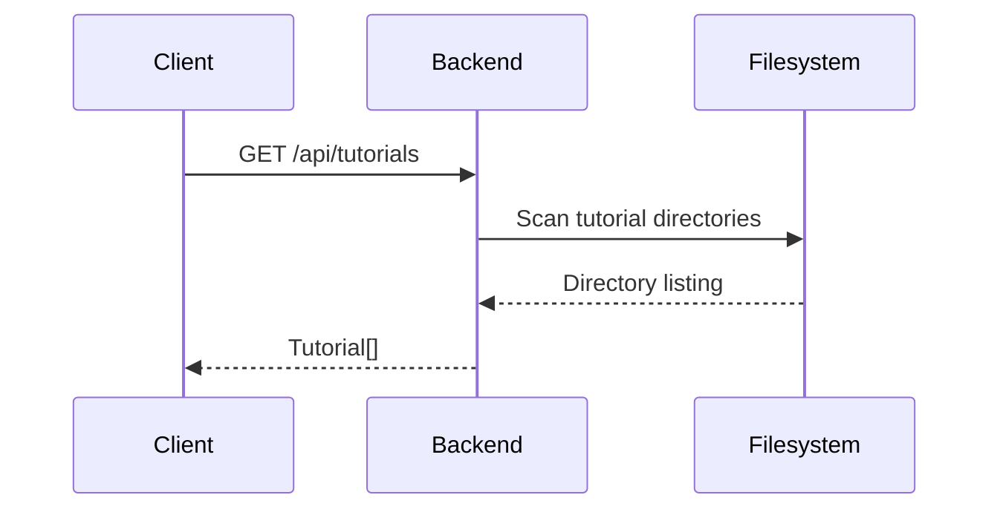
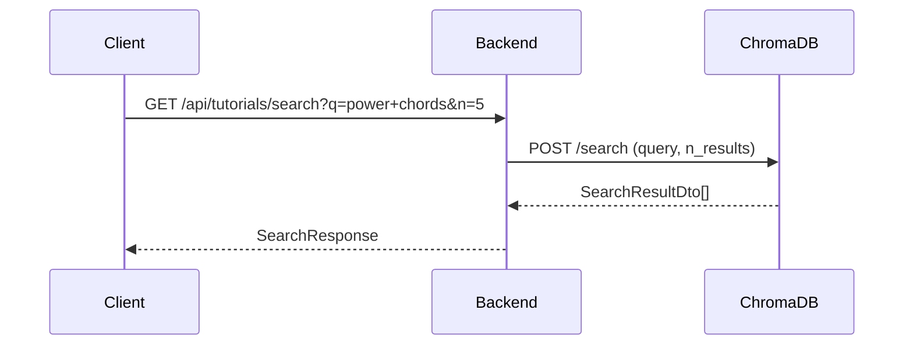
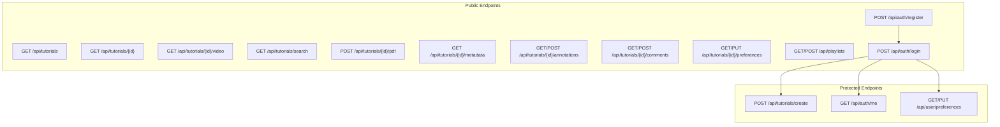

# API Reference — Guitar Tutorial Manager

| Purpose | Audience | Status | Date |
|---------|----------|--------|------|
| Complete reference for all REST API endpoints | Frontend developers, iOS developers, integrators | Draft | 2026-05-02 |

**Base URL**: `/api` (proxied through nginx in production)

**Authentication**: Bearer token in `Authorization` header for protected endpoints.

---

## 1. Tutorials

### 1.1 List Tutorials

`GET /api/tutorials`

Returns all tutorial directories found on the filesystem.



**Response `200 OK`**

```json
[
  {
    "id": "bestofyou",
    "name": "Best of You",
    "videoFilename": "lesson.mp4",
    "hasSubtitle": true,
    "hasTablature": true
  }
]
```

| Field | Type | Description |
|-------|------|-------------|
| `id` | `string` | Directory name (unique identifier) |
| `name` | `string` | Display name (directory name) |
| `videoFilename` | `string` | Name of the video file in the directory |
| `hasSubtitle` | `boolean` | Whether an SRT subtitle file exists |
| `hasTablature` | `boolean` | Whether a PDF tablature file exists |

### 1.2 Get Tutorial

`GET /api/tutorials/{id}`

**Path Parameters**

| Parameter | Type | Description |
|-----------|------|-------------|
| `id` | `string` | Tutorial directory name |

**Response `200 OK`**: Same schema as [`TutorialInfo`](../backend/src/main/java/com/guitartutorial/dto/TutorialInfo.java:1).

**Error**: `404 Not Found` — tutorial directory does not exist.

### 1.3 Stream Video

`GET /api/tutorials/{id}/video`

Supports HTTP Range headers for partial content delivery (1MB chunks).

**Request Headers**

| Header | Example | Description |
|--------|---------|-------------|
| `Range` | `bytes=0-1048575` | Byte range for chunked streaming |

**Response `206 Partial Content`**

| Header | Description |
|--------|-------------|
| `Content-Type` | `video/mp4` (or appropriate media type) |
| `Content-Range` | `bytes 0-1048575/12345678` |

**Response `200 OK`** (if no Range header): Full video stream.

### 1.4 Create Tutorial

`POST /api/tutorials/create`

**Authentication**: Required (Bearer token)

**Request** (multipart/form-data)

| Field | Type | Required | Description |
|-------|------|----------|-------------|
| `tutorialId` | `string` | Yes | Alphanumeric ID (letters, numbers, hyphens, underscores) |
| `displayName` | `string` | No | Human-readable name |
| `video` | `file` | No | Video file (mp4, mkv, webm, avi, mov) |
| `pdf` | `file` | No | PDF tablature file |

**Response `201 Created`**

```json
{
  "tutorialId": "bestofyou",
  "displayName": "Best of You",
  "videoUploaded": true,
  "pdfUploaded": false,
  "videoFilename": "lesson.mp4",
  "pdfFilename": null,
  "message": "Tutorial 'bestofyou' created successfully."
}
```

**Errors**: `400 Bad Request` (invalid ID, duplicate), `401 Unauthorized`.

---

## 2. PDF & Metadata

### 2.1 Upload PDF

`POST /api/tutorials/{id}/pdf`

Upload a PDF tablature file and trigger automatic metadata extraction + ChromaDB indexing.

**Request** (multipart/form-data)

| Field | Type | Required | Description |
|-------|------|----------|-------------|
| `file` | `file` | Yes | PDF file |

**Response `200 OK`**

```json
{
  "tutorialId": "bestofyou",
  "title": "Best of You",
  "tuning": "Standard",
  "musicalKey": "F major",
  "difficulty": "Intermediate",
  "techniques": "power chords, palm muting, bends",
  "genre": "Rock",
  "extractedAt": "2026-05-02T09:00:00"
}
```

### 2.2 Get Metadata

`GET /api/tutorials/{id}/metadata`

Returns extracted metadata for a tutorial.

**Response `200 OK`**: Same schema as [`TutorialMetadataDto`](../backend/src/main/java/com/guitartutorial/dto/TutorialMetadataDto.java:1).

**Error**: `404 Not Found` — no metadata extracted yet.

### 2.3 Semantic Search

`GET /api/tutorials/search?q={query}&n={results}`

Search across all indexed tutorial content using ChromaDB vector similarity.



**Query Parameters**

| Parameter | Type | Default | Description |
|-----------|------|---------|-------------|
| `q` | `string` | — | Search query text |
| `n` | `int` | `10` | Maximum number of results |

**Response `200 OK`**

```json
{
  "query": "power chords",
  "results": [
    {
      "tutorialId": "bestofyou",
      "title": "Best of You",
      "name": "Best of You",
      "tuning": "Standard",
      "musicalKey": "F major",
      "difficulty": "Intermediate",
      "techniques": "power chords, palm muting, bends",
      "genre": "Rock",
      "hasSubtitle": true,
      "hasTablature": true,
      "relevanceScore": 0.89,
      "matchedChunks": ["...power chords in the chorus..."]
    }
  ],
  "totalResults": 1
}
```

---

## 3. Annotations

Base path: `/api/tutorials/{tutorialId}/annotations`

### 3.1 List Annotations

`GET /api/tutorials/{tutorialId}/annotations`

Returns all annotations for a tutorial.

### 3.2 Create Annotation

`POST /api/tutorials/{tutorialId}/annotations`

**Request Body**

```json
{
  "pageNumber": 1,
  "x": 10.5,
  "y": 20.3,
  "width": 100.0,
  "height": 30.0,
  "content": "This is the verse riff",
  "type": "highlight",
  "strokeData": "[{\"x\":10,\"y\":50},{\"x\":80,\"y\":50}]",
  "color": "#FFD700"
}
```

| Field | Type | Description |
|-------|------|-------------|
| `pageNumber` | `int` | PDF page number |
| `x`, `y` | `double` | Position on page |
| `width`, `height` | `double` | Bounding box dimensions |
| `content` | `string` | Annotation text |
| `type` | `enum` | `text`, `underline`, `highlight`, `drawing` |
| `strokeData` | `string` | JSON array of stroke points (for drawing/underline/highlight) |
| `color` | `string` | Hex colour (e.g. `#FFD700`) |

### 3.3 Update Annotation

`PUT /api/tutorials/{tutorialId}/annotations/{annotationId}`

Same body schema as create.

### 3.4 Delete Annotation

`DELETE /api/tutorials/{tutorialId}/annotations/{annotationId}`

**Response**: `204 No Content`

---

## 4. Comments

Base path: `/api/tutorials/{tutorialId}/comments`

### 4.1 List Comments

`GET /api/tutorials/{tutorialId}/comments`

### 4.2 Create Comment

`POST /api/tutorials/{tutorialId}/comments`

**Request Body**

```json
{
  "text": "Great lesson on barre chords!"
}
```

### 4.3 Update Comment

`PUT /api/tutorials/{tutorialId}/comments/{commentId}`

### 4.4 Delete Comment

`DELETE /api/tutorials/{tutorialId}/comments/{commentId}`

**Response**: `204 No Content`

---

## 5. Playlists

Base path: `/api/playlists`

### 5.1 List Playlists

`GET /api/playlists`

```json
[
  {
    "id": 1,
    "name": "Rock Riffs",
    "createdAt": "2026-04-28T10:00:00",
    "tutorials": [
      {
        "tutorialId": "bestofyou",
        "tutorialName": "Best of You",
        "ordinalPosition": 0
      }
    ]
  }
]
```

### 5.2 Create Playlist

`POST /api/playlists`

**Request Body**

```json
{
  "name": "Fingerpicking Songs"
}
```

### 5.3 Get Playlist

`GET /api/playlists/{id}`

### 5.4 Update Playlist Name

`PUT /api/playlists/{id}`

**Request Body**: Same as create.

### 5.5 Delete Playlist

`DELETE /api/playlists/{id}`

**Response**: `204 No Content`

### 5.6 Add Tutorial to Playlist

`POST /api/playlists/{id}/tutorials`

**Request Body**

```json
{
  "tutorialId": "bestofyou"
}
```

### 5.7 Reorder Tutorials in Playlist

`PUT /api/playlists/{id}/tutorials`

**Request Body**

```json
{
  "tutorialIds": ["bestofyou", "blackbird", "tears-in-heaven"]
}
```

### 5.8 Remove Tutorial from Playlist

`DELETE /api/playlists/{id}/tutorials/{tutorialId}`

**Response**: `204 No Content`

---

## 6. Per-Tutorial Preferences

Base path: `/api/tutorials/{tutorialId}/preferences`

### 6.1 Get Preferences

`GET /api/tutorials/{tutorialId}/preferences`

```json
{
  "tutorialId": "bestofyou",
  "difficultyLevel": "Intermediate",
  "favorite": true
}
```

### 6.2 Upsert Preferences

`PUT /api/tutorials/{tutorialId}/preferences`

**Request Body**: Same schema as response.

---

## 7. Authentication

Base path: `/api/auth`

### 7.1 Register

`POST /api/auth/register`

**Request Body**

```json
{
  "username": "johndoe",
  "email": "john@example.com",
  "password": "securePassword123",
  "displayName": "John Doe"
}
```

**Response `200 OK`**

```json
{
  "userId": 1,
  "username": "johndoe",
  "displayName": "John Doe",
  "token": "eyJhbGciOiJIUzI1NiJ9..."
}
```

### 7.2 Login

`POST /api/auth/login`

**Request Body**

```json
{
  "username": "johndoe",
  "password": "securePassword123"
}
```

**Response**: Same schema as register.

### 7.3 Get Current User

`GET /api/auth/me`

**Authentication**: Required (Bearer token)

**Response `200 OK`**

```json
{
  "id": 1,
  "username": "johndoe",
  "email": "john@example.com",
  "displayName": "John Doe",
  "createdAt": "2026-04-01T12:00:00"
}
```

---

## 8. User Preferences

Base path: `/api/user/preferences`

**Authentication**: Required (Bearer token)

### 8.1 Get Preferences

`GET /api/user/preferences`

```json
{
  "userId": 1,
  "theme": "dark",
  "defaultDifficultyFilter": "All",
  "defaultSortDirection": "asc",
  "itemsPerPage": 20,
  "updatedAt": "2026-05-01T08:00:00"
}
```

### 8.2 Update Preferences

`PUT /api/user/preferences`

**Request Body**: Same schema as response.

---

## 9. Error Handling

All errors return a JSON body with an `error` field:

```json
{
  "error": "Tutorial not found: bestofyou"
}
```

| HTTP Status | Meaning |
|-------------|---------|
| `400` | Validation error or bad request |
| `401` | Missing or invalid authentication token |
| `404` | Resource not found |
| `500` | Internal server error |

Custom exception classes:

| Exception | HTTP Status |
|-----------|-------------|
| [`ValidationException`](../backend/src/main/java/com/guitartutorial/exception/ValidationException.java:1) | `400` |
| [`ResourceNotFoundException`](../backend/src/main/java/com/guitartutorial/exception/ResourceNotFoundException.java:1) | `404` |
| [`TutorialNotFoundException`](../backend/src/main/java/com/guitartutorial/exception/TutorialNotFoundException.java:1) | `404` |
| [`StorageAccessException`](../backend/src/main/java/com/guitartutorial/exception/StorageAccessException.java:1) | `500` |
| [`SubtitleGenerationFailedException`](../backend/src/main/java/com/guitartutorial/exception/SubtitleGenerationFailedException.java:1) | `500` |

---

## 10. API Overview Diagram


