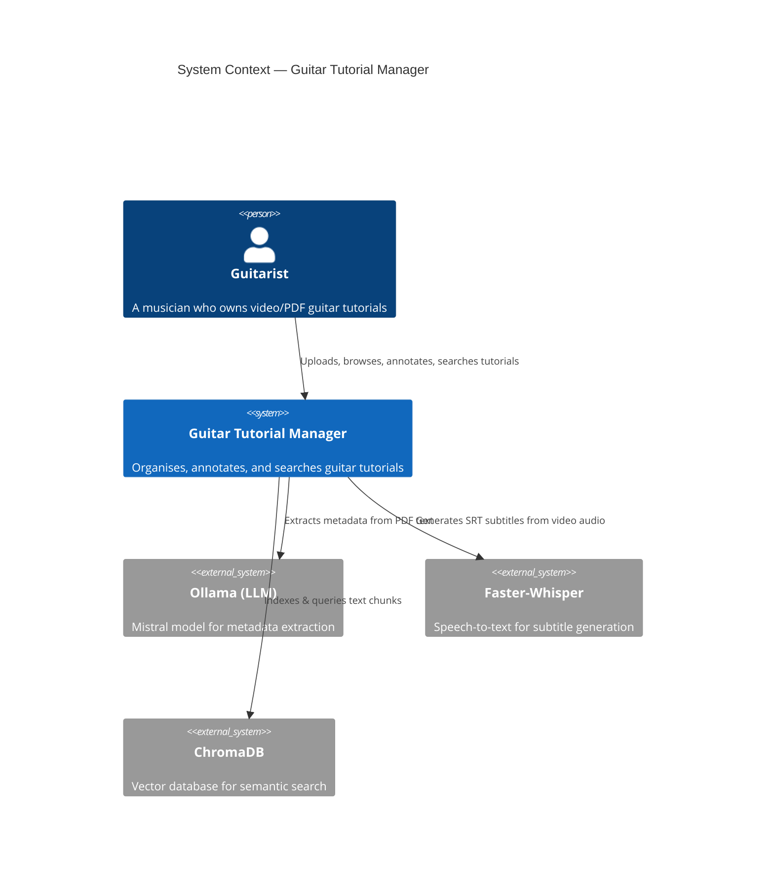
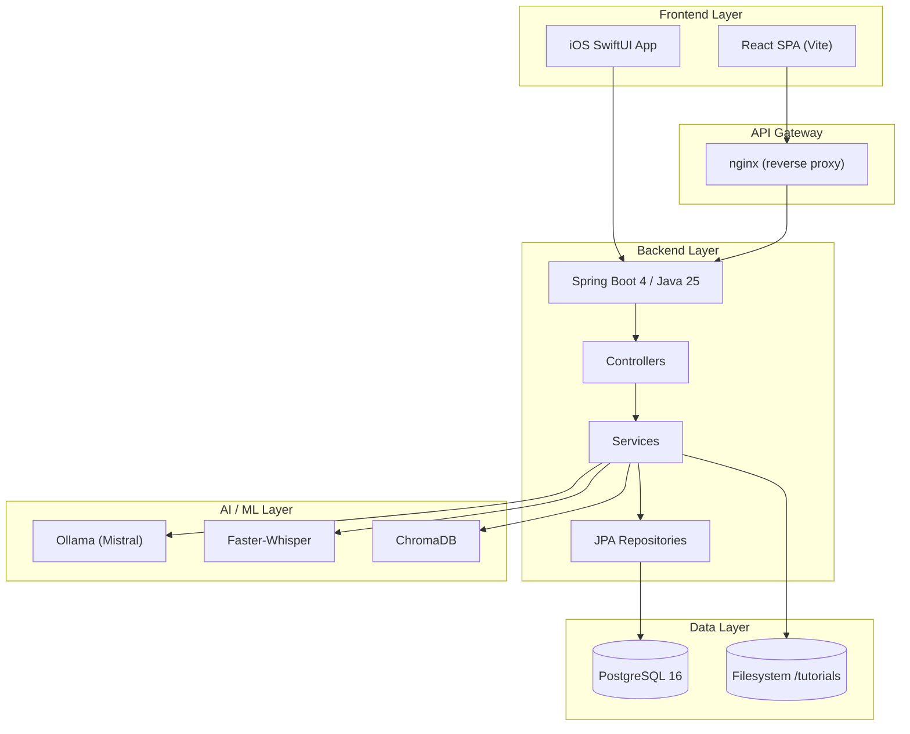
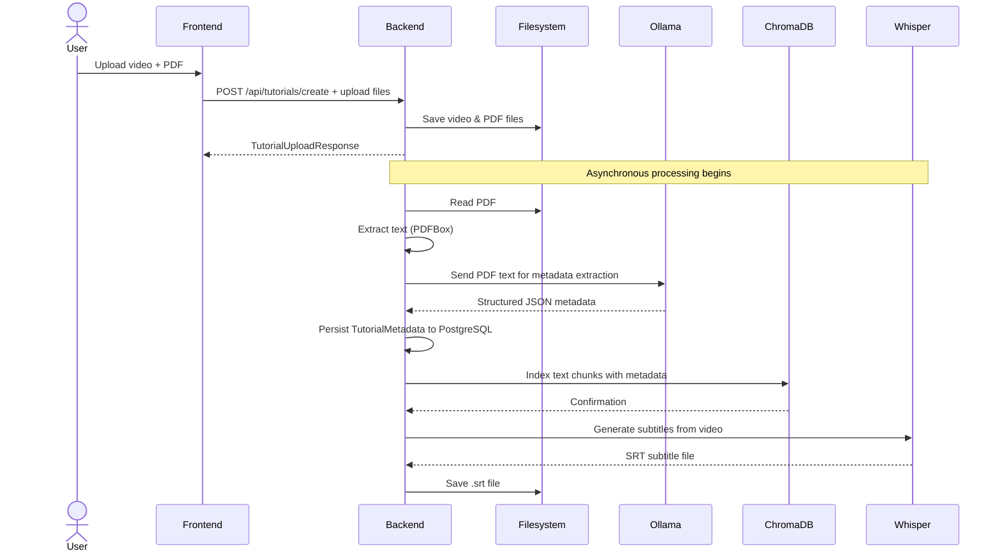
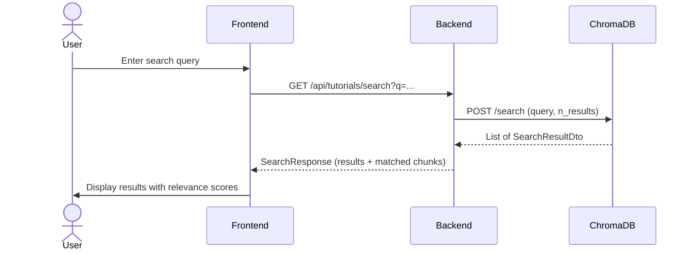
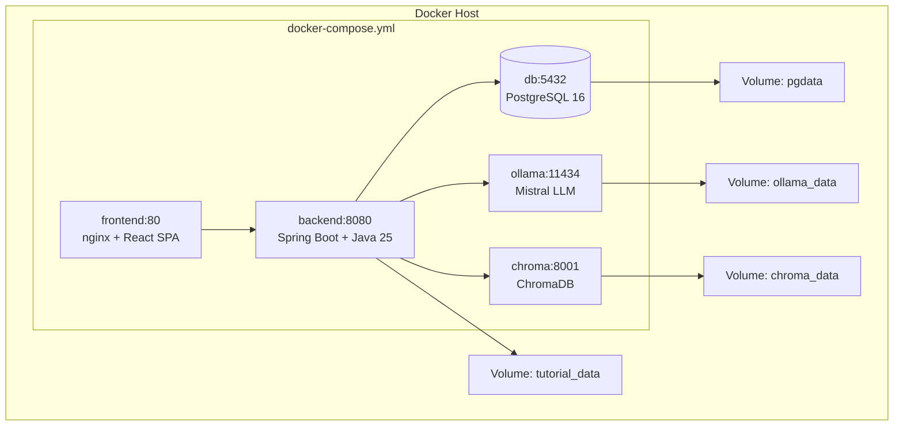

# Architecture Overview — Guitar Tutorial Manager

| Purpose | Audience | Status | Date |
|---------|----------|--------|------|
| Describe the system architecture, component interactions, and technology stack | Developers, architects, DevOps | Draft | 2026-05-02 |

---

## 1. System Context

Guitar Tutorial Manager is a full-stack web application (with an iOS companion) that helps guitarists organize, annotate, and search their collection of video-and-PDF tutorial files. Users upload tutorials (video + PDF tablature), the system automatically extracts metadata via an LLM (Mistral/Ollama), generates subtitles via Faster-Whisper, and indexes the content into ChromaDB for semantic search.

### C4 Context Diagram

---

## 2. High-Level Architecture

The system follows a **layered microservices architecture** deployed via Docker Compose. Each service runs in its own container.

### Technology Stack

| Layer | Technology | Version |
|-------|-----------|---------|
| Frontend (Web) | React 18, TypeScript, Vite, React Router 6 | 18.x |
| Frontend (iOS) | SwiftUI, async/await | iOS 17+ |
| Backend | Spring Boot, Java 25, Maven | 4.0.6 |
| Database | PostgreSQL (prod) / H2 (dev) | 16 / embedded |
| Vector DB | ChromaDB (Python) | latest |
| LLM | Ollama + Mistral | latest |
| Speech-to-Text | Faster-Whisper (Python) | latest |
| Reverse Proxy | nginx | latest |
| Containerisation | Docker Compose | 3.8 |

---

## 3. Component Breakdown

### 3.1 Backend (Spring Boot)

The backend is a monolithic Spring Boot application organised by layers:

- **Controllers** — REST endpoints under `/api/`
- **Services** — Business logic, orchestration, external integrations
- **Repositories** — Spring Data JPA interfaces for PostgreSQL/H2
- **Entities** — JPA entities mapped to database tables
- **DTOs** — Data transfer objects for API request/response contracts

#### Controller Map

| Controller | Base Path | Purpose |
|-----------|-----------|---------|
| [`TutorialController`](../backend/src/main/java/com/guitartutorial/controller/TutorialController.java:31) | `/api/tutorials` | List, get, stream video |
| [`TutorialUploadController`](../backend/src/main/java/com/guitartutorial/controller/TutorialUploadController.java:33) | `/api/tutorials` | Create tutorial, upload video/PDF |
| [`PdfController`](../backend/src/main/java/com/guitartutorial/controller/PdfController.java:35) | `/api/tutorials` | Upload PDF, extract metadata, search |
| [`AnnotationController`](../backend/src/main/java/com/guitartutorial/controller/AnnotationController.java:21) | `/api/tutorials/{id}/annotations` | CRUD annotations |
| [`CommentController`](../backend/src/main/java/com/guitartutorial/controller/CommentController.java:22) | `/api/tutorials/{id}/comments` | CRUD comments |
| [`PreferenceController`](../backend/src/main/java/com/guitartutorial/controller/PreferenceController.java:14) | `/api/tutorials/{id}/preferences` | Per-tutorial preferences |
| [`PlaylistController`](../backend/src/main/java/com/guitartutorial/controller/PlaylistController.java:23) | `/api/playlists` | CRUD playlists + reorder |
| [`AuthController`](../backend/src/main/java/com/guitartutorial/controller/AuthController.java:23) | `/api/auth` | Register, login, token validation |
| [`UserPreferenceController`](../backend/src/main/java/com/guitartutorial/controller/UserPreferenceController.java:17) | `/api/user/preferences` | Global user preferences |

### 3.2 Frontend (React SPA)

The web frontend is a single-page application with client-side routing:

| Page | Route | Purpose |
|------|-------|---------|
| [`SongLibrary`](../frontend/src/pages/SongLibrary.tsx:1) | `/` | Browse, filter, search tutorials |
| [`TutorialDetail`](../frontend/src/pages/TutorialDetail.tsx:1) | `/tutorial/:id` | Video player, PDF viewer, annotations, comments |
| [`PlaylistManager`](../frontend/src/pages/PlaylistManager.tsx:1) | `/playlists` | Create, manage, reorder playlists |
| [`AuthPage`](../frontend/src/pages/AuthPage.tsx:1) | `/auth` | Login / register |
| [`UserPreferencesPage`](../frontend/src/pages/UserPreferencesPage.tsx:1) | `/preferences` | Theme, pagination, default filters |

### 3.3 iOS App (SwiftUI)

The iOS companion app mirrors the web frontend's functionality using native SwiftUI patterns:

- **ViewModels** — Observable objects that drive UI state
- **Services** — Async HTTP clients via [`APIClient`](../ios/GuitarTutorial/Services/APIClient.swift:41)
- **Views** — SwiftUI views for each screen

### 3.4 AI / ML Services

#### Ollama (Mistral)
- Called by [`MetadataExtractionService`](../backend/src/main/java/com/guitartutorial/service/MetadataExtractionService.java:34) via a Python wrapper script
- Extracts structured metadata (title, tuning, key, difficulty, techniques, genre) from PDF text
- Runs on port 11434, optionally with GPU acceleration

#### Faster-Whisper
- Called by [`SubtitleGenerationService`](../backend/src/main/java/com/guitartutorial/service/SubtitleGenerationService.java:30) via a Python script
- Generates SRT subtitle files from video audio tracks
- Runs asynchronously; subtitles become available once generation completes

#### ChromaDB
- A Python-based vector database running on port 8001
- Indexes text chunks from PDFs with associated metadata
- Provides semantic search via [`ChromaServiceClient`](../backend/src/main/java/com/guitartutorial/service/ChromaServiceClient.java:29)

---

## 4. Data Flow Diagrams

### 4.1 Tutorial Upload & Processing Flow

### 4.2 Semantic Search Flow

### 4.3 Video Streaming Flow

```mermaid
sequenceDiagram
  actor User
  participant Frontend
  participant Backend
  participant Filesystem

  User->>Frontend: Click play on tutorial
  Frontend->>Backend: GET /api/tutorials/{id}/video (with Range header)
  Backend->>Filesystem: Read video file chunk
  Backend-->>Frontend: HTTP 206 Partial Content (1MB chunk)
  Frontend->>User: Play video chunk
  Note over Frontend,Backend: Subsequent chunks requested as needed
```

---

## 5. Deployment Architecture

All services are defined in [`docker-compose.yml`](../docker-compose.yml:1) (production) and [`docker-compose.dev.yml`](../docker-compose.dev.yml:1) (development with H2).

---

## 6. Security Architecture

- **Authentication**: Token-based (Bearer token) via [`AuthController`](../backend/src/main/java/com/guitartutorial/controller/AuthController.java:23)
- **Password storage**: Hashed (handled by [`UserService`](../backend/src/main/java/com/guitartutorial/service/UserService.java:1))
- **Protected endpoints**: Tutorial creation, user preferences require valid token
- **Public endpoints**: Tutorial listing, video streaming, PDF serving, search
- **iOS**: Token stored in Keychain via [`KeychainManager`](../ios/GuitarTutorial/Services/KeychainManager.swift:1)

---

## 7. Key Design Decisions

| Decision | Rationale |
|----------|-----------|
| **Monolithic backend** | Single team, small scope; avoids microservice overhead |
| **Filesystem-based tutorial storage** | Tutorials are large media files; DB不适合; Docker volume for persistence |
| **Python scripts for AI tasks** | Faster-Whisper and ChromaDB are Python-native; Spring Boot delegates via subprocess/HTTP |
| **H2 for dev, PostgreSQL for prod** | Zero-config local development; robust production storage |
| **Chunked video streaming** | 1MB chunks enable seeking and reduce memory pressure |
| **Async subtitle generation** | Videos can play immediately; subtitles appear when ready |
