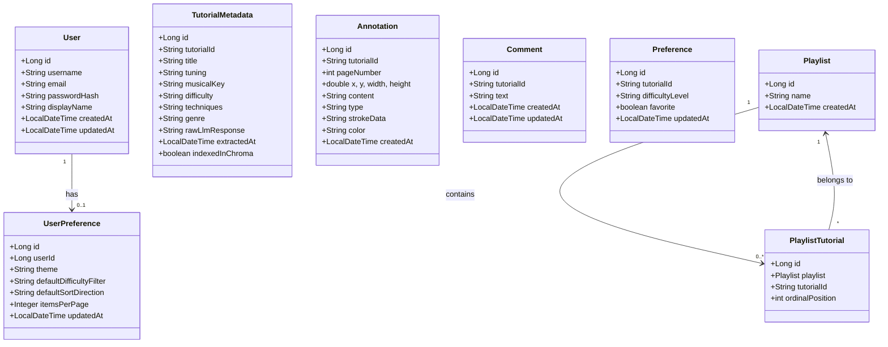

# Data Model — Guitar Tutorial Manager

| Purpose | Audience | Status | Date |
|---------|----------|--------|------|
| Document all JPA entities, relationships, and database schema | Backend developers, DBAs, DevOps | Draft | 2026-05-02 |

---

## 1. Entity Relationship Diagram

```mermaid
erDiagram
    User {
        long id PK
        string username UK
        string email UK
        string passwordHash
        string displayName
        datetime createdAt
        datetime updatedAt
    }

    UserPreference {
        long id PK
        long userId UK FK
        string theme
        string defaultDifficultyFilter
        string defaultSortDirection
        int itemsPerPage
        datetime updatedAt
    }

    TutorialMetadata {
        long id PK
        string tutorialId UK
        string title
        string tuning
        string musicalKey
        string difficulty
        string techniques
        string genre
        text rawLlmResponse
        datetime extractedAt
        boolean indexedInChroma
    }

    Annotation {
        long id PK
        string tutorialId
        int pageNumber
        double x
        double y
        double width
        double height
        text content
        string type
        text strokeData
        string color
        datetime createdAt
    }

    Comment {
        long id PK
        string tutorialId
        text text
        datetime createdAt
        datetime updatedAt
    }

    Preference {
        long id PK
        string tutorialId UK
        string difficultyLevel
        boolean favorite
        datetime updatedAt
    }

    Playlist {
        long id PK
        string name
        datetime createdAt
    }

    PlaylistTutorial {
        long id PK
        long playlistId FK
        string tutorialId
        int ordinalPosition
    }

    User ||--o| UserPreference : "has"
    Playlist ||--o{ PlaylistTutorial : "contains"
```

---

## 2. Entity Details

### 2.1 [`User`](../backend/src/main/java/com/guitartutorial/entity/User.java:13)

Stores registered user accounts.

| Column | Type | Constraints | Description |
|--------|------|-------------|-------------|
| `id` | `BIGINT` | PK, auto-increment | Unique user identifier |
| `username` | `VARCHAR(100)` | NOT NULL, UNIQUE | Login username |
| `email` | `VARCHAR(255)` | NOT NULL, UNIQUE | Email address |
| `password_hash` | `VARCHAR(255)` | NOT NULL | BCrypt-hashed password |
| `display_name` | `VARCHAR(255)` | nullable | Human-readable name |
| `created_at` | `TIMESTAMP` | NOT NULL | Account creation time |
| `updated_at` | `TIMESTAMP` | nullable | Last update time |

**Table name**: `app_user` (since `user` is a reserved word in PostgreSQL)

### 2.2 [`UserPreference`](../backend/src/main/java/com/guitartutorial/entity/UserPreference.java:17)

Global user-level settings (not per-tutorial).

| Column | Type | Constraints | Description |
|--------|------|-------------|-------------|
| `id` | `BIGINT` | PK, auto-increment | Unique ID |
| `user_id` | `BIGINT` | NOT NULL, UNIQUE, FK → `app_user.id` | Owning user |
| `theme` | `VARCHAR(20)` | nullable | `"light"` or `"dark"` |
| `default_difficulty_filter` | `VARCHAR(20)` | nullable | Default filter on song library |
| `default_sort_direction` | `VARCHAR(10)` | nullable | `"asc"` or `"desc"` |
| `items_per_page` | `INTEGER` | nullable | Pagination size |
| `updated_at` | `TIMESTAMP` | nullable | Last update time |

### 2.3 [`TutorialMetadata`](../backend/src/main/java/com/guitartutorial/entity/TutorialMetadata.java:17)

Structured metadata extracted from PDF tablature via Mistral/Ollama.

| Column | Type | Constraints | Description |
|--------|------|-------------|-------------|
| `id` | `BIGINT` | PK, auto-increment | Unique ID |
| `tutorial_id` | `VARCHAR(255)` | NOT NULL, UNIQUE | Tutorial directory name |
| `title` | `VARCHAR(255)` | nullable | Song title |
| `tuning` | `VARCHAR(255)` | nullable | Guitar tuning (e.g. "Standard") |
| `musical_key` | `VARCHAR(255)` | nullable | Musical key (e.g. "F major") |
| `difficulty` | `VARCHAR(255)` | nullable | "Beginner", "Intermediate", "Advanced" |
| `techniques` | `VARCHAR(1000)` | nullable | Comma-separated techniques |
| `genre` | `VARCHAR(255)` | nullable | Genre/style |
| `raw_llm_response` | `TEXT` | nullable | Raw JSON from LLM (debugging) |
| `extracted_at` | `TIMESTAMP` | nullable | When metadata was extracted |
| `indexed_in_chroma` | `BOOLEAN` | default `false` | Whether indexed in ChromaDB |

### 2.4 [`Annotation`](../backend/src/main/java/com/guitartutorial/entity/Annotation.java:12)

User-created annotations on PDF pages (text notes, highlights, underlines, drawings).

| Column | Type | Constraints | Description |
|--------|------|-------------|-------------|
| `id` | `BIGINT` | PK, auto-increment | Unique ID |
| `tutorial_id` | `VARCHAR(255)` | NOT NULL | Tutorial directory name |
| `page_number` | `INT` | NOT NULL | PDF page number |
| `x` | `DOUBLE` | NOT NULL | X position on page |
| `y` | `DOUBLE` | NOT NULL | Y position on page |
| `width` | `DOUBLE` | NOT NULL | Bounding box width |
| `height` | `DOUBLE` | NOT NULL | Bounding box height |
| `content` | `TEXT` | nullable | Annotation text |
| `type` | `VARCHAR(255)` | NOT NULL | `text`, `underline`, `highlight`, `drawing` |
| `stroke_data` | `TEXT` | nullable | JSON array of stroke points |
| `color` | `VARCHAR(255)` | nullable | Hex colour (e.g. `#FFD700`) |
| `created_at` | `TIMESTAMP` | NOT NULL | Creation time |

### 2.5 [`Comment`](../backend/src/main/java/com/guitartutorial/entity/Comment.java:12)

User comments on tutorials.

| Column | Type | Constraints | Description |
|--------|------|-------------|-------------|
| `id` | `BIGINT` | PK, auto-increment | Unique ID |
| `tutorial_id` | `VARCHAR(255)` | NOT NULL | Tutorial directory name |
| `text` | `TEXT` | NOT NULL | Comment body |
| `created_at` | `TIMESTAMP` | NOT NULL | Creation time |
| `updated_at` | `TIMESTAMP` | nullable | Last edit time |

### 2.6 [`Preference`](../backend/src/main/java/com/guitartutorial/entity/Preference.java:12)

Per-tutorial user preferences (favourite status, difficulty override).

| Column | Type | Constraints | Description |
|--------|------|-------------|-------------|
| `id` | `BIGINT` | PK, auto-increment | Unique ID |
| `tutorial_id` | `VARCHAR(255)` | NOT NULL, UNIQUE | Tutorial directory name |
| `difficulty_level` | `VARCHAR(255)` | nullable | User-assigned difficulty |
| `favorite` | `BOOLEAN` | NOT NULL | Whether marked as favourite |
| `updated_at` | `TIMESTAMP` | nullable | Last update time |

### 2.7 [`Playlist`](../backend/src/main/java/com/guitartutorial/entity/Playlist.java:17)

A named collection of tutorials in a specific order.

| Column | Type | Constraints | Description |
|--------|------|-------------|-------------|
| `id` | `BIGINT` | PK, auto-increment | Unique ID |
| `name` | `VARCHAR(255)` | NOT NULL | Playlist name |
| `created_at` | `TIMESTAMP` | NOT NULL | Creation time |

### 2.8 [`PlaylistTutorial`](../backend/src/main/java/com/guitartutorial/entity/PlaylistTutorial.java:13)

Join entity linking a playlist to a tutorial with positional ordering.

| Column | Type | Constraints | Description |
|--------|------|-------------|-------------|
| `id` | `BIGINT` | PK, auto-increment | Unique ID |
| `playlist_id` | `BIGINT` | NOT NULL, FK → `playlist.id` | Parent playlist |
| `tutorial_id` | `VARCHAR(255)` | NOT NULL | Tutorial directory name |
| `ordinal_position` | `INT` | NOT NULL | Sort order (0-based) |

---

## 3. Relationship Summary



---

## 4. Key Relationships

| Relationship | Type | Description |
|-------------|------|-------------|
| User → UserPreference | One-to-One | Each user has at most one global preference row |
| Playlist → PlaylistTutorial | One-to-Many | Cascade ALL, orphan removal; ordered by `ordinalPosition` |
| TutorialMetadata | Standalone | Keyed by `tutorialId` (directory name), no FK to other tables |
| Annotation | Standalone | Referenced by `tutorialId` string, no FK constraint |
| Comment | Standalone | Referenced by `tutorialId` string, no FK constraint |
| Preference | Standalone | Referenced by `tutorialId` string, no FK constraint |

> **Note**: `Annotation`, `Comment`, `Preference`, and `TutorialMetadata` reference tutorials by their directory name string (`tutorialId`) rather than via a foreign key. This is because tutorials are filesystem-based, not stored as database rows.

---

## 5. Database Configuration

| Environment | Database | Driver |
|-------------|----------|--------|
| Production (`prod` profile) | PostgreSQL 16 | `org.postgresql.Driver` |
| Development (`local` profile) | H2 (in-memory) | `org.h2.Driver` |

Configured via [`pom.xml`](../backend/pom.xml:44) with both drivers available at runtime.

---

## 6. Indexes

| Entity | Column(s) | Type | Purpose |
|--------|-----------|------|---------|
| `User` | `username` | UNIQUE | Login lookup |
| `User` | `email` | UNIQUE | Duplicate prevention |
| `UserPreference` | `user_id` | UNIQUE | One preference per user |
| `TutorialMetadata` | `tutorial_id` | UNIQUE | One metadata record per tutorial |
| `Preference` | `tutorial_id` | UNIQUE | One preference per tutorial |
| `PlaylistTutorial` | `playlist_id`, `ordinal_position` | Composite | Ordering queries |
