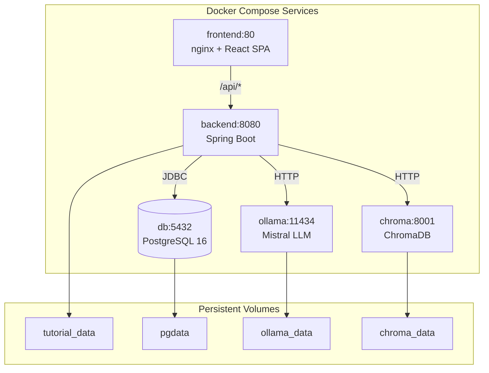
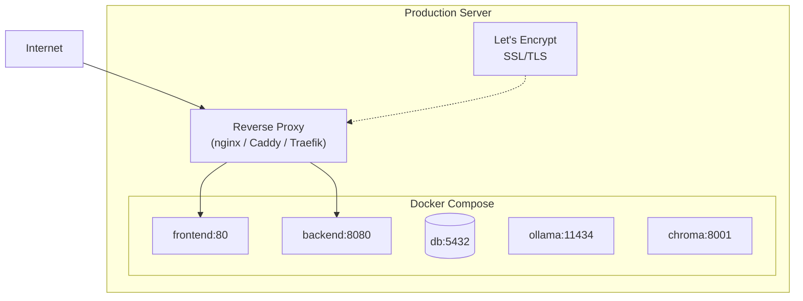

# Deployment Guide — Guitar Tutorial Manager

| Purpose | Audience | Status | Date |
|---------|----------|--------|------|
| Step-by-step instructions for local development and production deployment | Developers, DevOps | Draft | 2026-05-02 |

---

## 1. Prerequisites

| Tool | Version | Purpose |
|------|---------|---------|
| Docker & Docker Compose | 24+ / 2.23+ | Container orchestration |
| Java (optional, for local backend) | 25 | Running backend outside Docker |
| Node.js (optional, for local frontend) | 20+ | Running frontend outside Docker |
| Maven (optional, for local backend) | 3.9+ | Building backend |
| NVIDIA Container Toolkit (optional) | latest | GPU acceleration for Ollama |

---

## 2. Architecture Overview



---

## 3. Quick Start (Development)

### 3.1 Clone and Configure

```bash
git clone <repository-url>
cd guitar-tutoma-ai
cp .env.example .env
```

Edit [`.env`](../.env.example:1) to adjust ports or database credentials if needed.

### 3.2 Start with Docker Compose (Development — H2 Database)

```bash
docker compose -f docker-compose.dev.yml up --build
```

This starts all services except PostgreSQL (uses H2 in-memory database).

| Service | URL |
|---------|-----|
| Frontend | http://localhost:3000 |
| Backend API | http://localhost:8080 |
| Ollama | http://localhost:11434 |
| ChromaDB | http://localhost:8001 |

### 3.3 Start with Docker Compose (Production-like — PostgreSQL)

```bash
docker compose up --build
```

This starts all services including PostgreSQL.

---

## 4. Service Configuration

### 4.1 Environment Variables

All configuration is via environment variables defined in [`.env.example`](../.env.example:1).

| Variable | Default | Description |
|----------|---------|-------------|
| `TUTORIALS_DIR` | `./tutorials` | Path to tutorial files (local) or `/tutorials` (Docker) |
| `FRONTEND_PORT` | `3000` | Host port for frontend |
| `BACKEND_PORT` | `8080` | Host port for backend |
| `DB_NAME` | `guitardb` | PostgreSQL database name |
| `DB_USER` | `guitar` | PostgreSQL username |
| `DB_PASSWORD` | `guitar` | PostgreSQL password |
| `OLLAMA_MODEL` | `mistral` | Ollama model for metadata extraction |

### 4.2 Backend Configuration

The Spring Boot backend uses profiles:

| Profile | Database | Config File |
|---------|----------|-------------|
| `local` | H2 (in-memory) | Used by [`docker-compose.dev.yml`](../docker-compose.dev.yml:1) |
| `prod` | PostgreSQL | Used by [`docker-compose.yml`](../docker-compose.yml:1) |

Additional Spring properties (configured in `application.properties` or `application.yml`):

| Property | Description |
|----------|-------------|
| `tutorials.directory` | Path to tutorial files |
| `ollama.url` | Ollama HTTP endpoint |
| `ollama.model` | LLM model name |
| `chroma.service.url` | ChromaDB HTTP endpoint |
| `scripts.directory` | Path to Python scripts |
| `subtitles.model-size` | Faster-Whisper model size (`base`, `small`, `medium`, `large`) |
| `subtitles.language` | Language code for transcription (default: `en`) |

---

## 5. Docker Images

### 5.1 Backend ([`backend/Dockerfile`](../backend/Dockerfile:1))

Multi-stage build:

1. **Build stage** — `maven:3.9-eclipse-temurin-25` compiles the Spring Boot app
2. **Runtime stage** — `eclipse-temurin:25-jre-alpine` runs the JAR + Python scripts

The runtime image includes:
- Python 3 with `faster-whisper` and `chromadb` installed in a virtual environment
- Python scripts in `/app/scripts/`

### 5.2 Frontend ([`frontend/nginx.conf`](../frontend/nginx.conf:1))

- Built with Vite into static files
- Served by nginx on port 80
- API requests proxied to `backend:8080`
- SPA routing: all non-file routes serve `index.html`
- Static assets cached with 1-year expiry

### 5.3 ChromaDB ([`backend/Dockerfile.chroma`](../backend/Dockerfile.chroma:1))

- Based on `python:3.11-slim`
- Runs `chroma_service.py` on port 8001
- Persists data to `/app/chroma_data`

---

## 6. GPU Acceleration (Ollama)

For faster LLM inference, enable GPU passthrough to the Ollama container.

### 6.1 Prerequisites

Install the [NVIDIA Container Toolkit](https://docs.nvidia.com/datacenter/cloud-native/container-toolkit/latest/install-guide.html):

```bash
# Ubuntu/Debian
distribution=$(. /etc/os-release;echo $ID$VERSION_ID)
curl -s -L https://nvidia.github.io/nvidia-docker/gpgkey | sudo apt-key add -
curl -s -L https://nvidia.github.io/nvidia-docker/$distribution/nvidia-docker.list | sudo tee /etc/apt/sources.list.d/nvidia-docker.list
sudo apt-get update && sudo apt-get install -y nvidia-container-toolkit
sudo systemctl restart docker
```

### 6.2 Verify

```bash
docker run --rm --gpus all nvidia/cuda:12.0-base nvidia-smi
```

### 6.3 Start with GPU

The [`docker-compose.yml`](../docker-compose.yml:52) already includes GPU device reservations for the Ollama service. Docker Compose will automatically use GPUs if the NVIDIA toolkit is installed.

---

## 7. Production Deployment

### 7.1 Recommended Setup



### 7.2 Steps

1. **Set up a server** with Docker and Docker Compose installed.
2. **Clone the repository** on the server.
3. **Configure environment** — copy [`.env.example`](../.env.example:1) to `.env` and set production values:
   - Strong database password
   - Appropriate `TUTORIALS_DIR` (e.g., `/volume1/music/guitar-tutorials`)
   - Production `OLLAMA_MODEL` (e.g., `mistral` or `mixtral`)
4. **Set up a reverse proxy** (nginx, Caddy, or Traefik) in front of the Docker host to handle:
   - SSL/TLS termination (Let's Encrypt)
   - Domain routing
   - Rate limiting
5. **Start the stack**:
   ```bash
   docker compose up -d --build
   ```
6. **Verify** — access the frontend at your domain, confirm API responses.

### 7.3 Backup Strategy

| Data | Location | Backup Method |
|------|----------|---------------|
| PostgreSQL data | `pgdata` volume | `pg_dump` or volume snapshot |
| Tutorial files | `tutorial_data` volume | File-level backup |
| ChromaDB index | `chroma_data` volume | Volume snapshot |
| Ollama models | `ollama_data` volume | Can be re-pulled |

---

## 8. Local Development (Without Docker)

### 8.1 Backend

```bash
cd backend
./mvnw spring-boot:run -Dspring-boot.run.profiles=local
```

Requires Java 25 and Maven. Uses H2 in-memory database.

### 8.2 Frontend

```bash
cd frontend
npm install
npm run dev
```

Runs on http://localhost:5173 (Vite dev server). API requests proxy to `http://localhost:8080`.

### 8.3 Python Services

```bash
# ChromaDB service
cd backend/scripts
pip install chromadb
python chroma_service.py --port 8001 --persist-dir ./chroma_data

# Metadata extraction (called by Spring Boot, not standalone)
python extract_metadata.py --ollama-url http://localhost:11434 --model mistral
```

---

## 9. Health Checks

| Service | Health Check Endpoint |
|---------|----------------------|
| Backend | `GET /api/tutorials` (returns 200 if accessible) |
| Ollama | `GET http://ollama:11434/api/tags` |
| ChromaDB | `GET http://chroma:8001/health` |
| PostgreSQL | Standard pg_isready |

---

## 10. Troubleshooting

| Problem | Likely Cause | Solution |
|---------|-------------|----------|
| Ollama model not found | Model not pulled on first start | Check Ollama logs; model pulls automatically on startup |
| ChromaDB connection refused | Chroma starts after backend | Restart the backend container: `docker compose restart backend` |
| Video streaming fails | File permissions on tutorial volume | Ensure `tutorial_data` volume is writable |
| Subtitle generation hangs | Insufficient RAM for Whisper | Reduce model size via `subtitles.model-size=base` |
| PDF extraction fails | PDF is scanned/image-only | OCR is not supported; use text-based PDFs |
