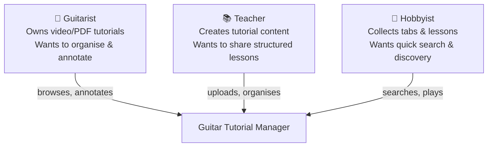
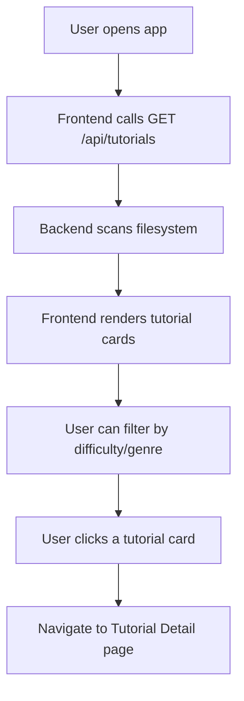
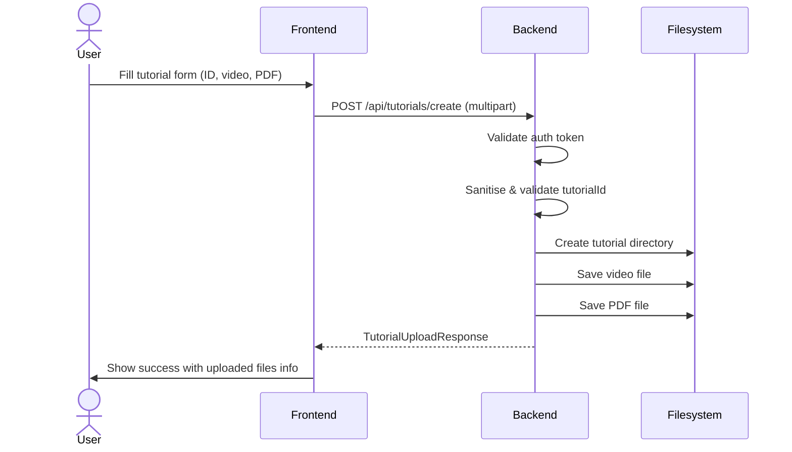
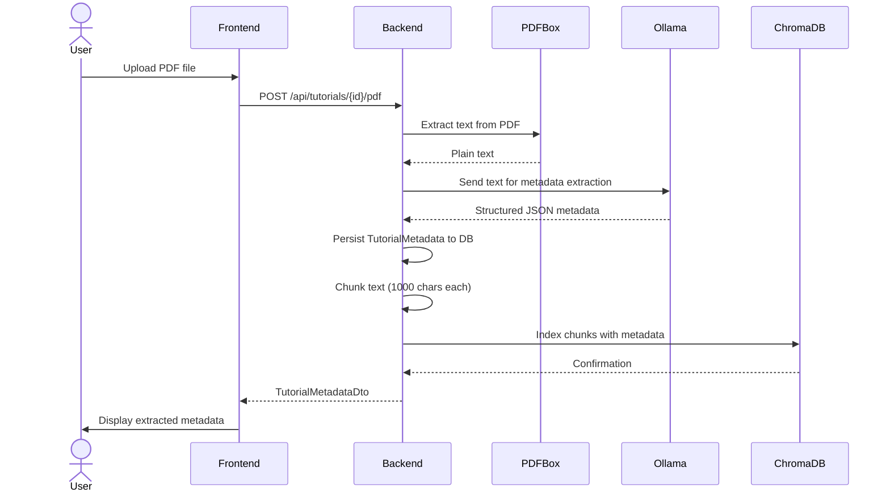
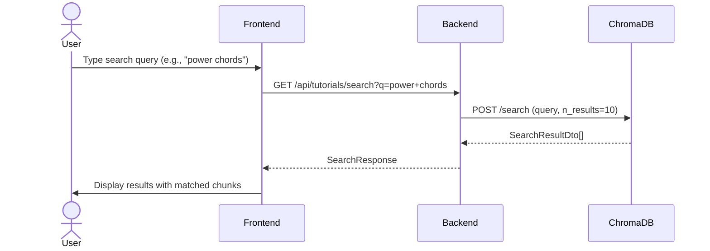
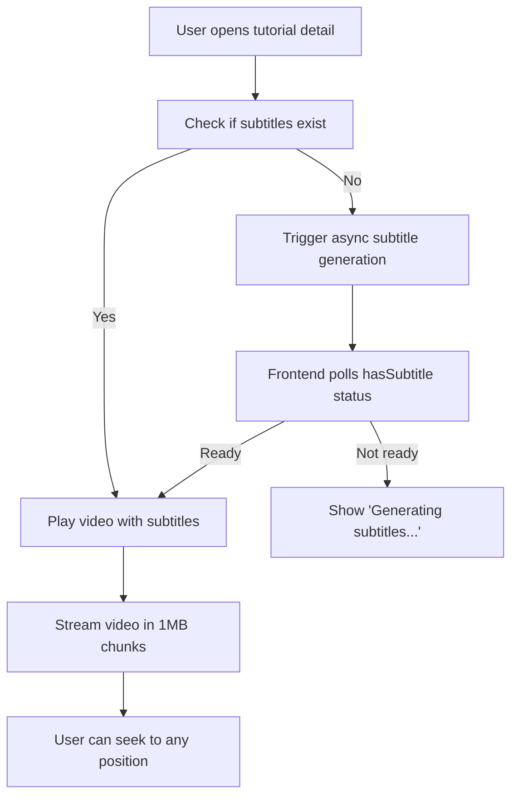
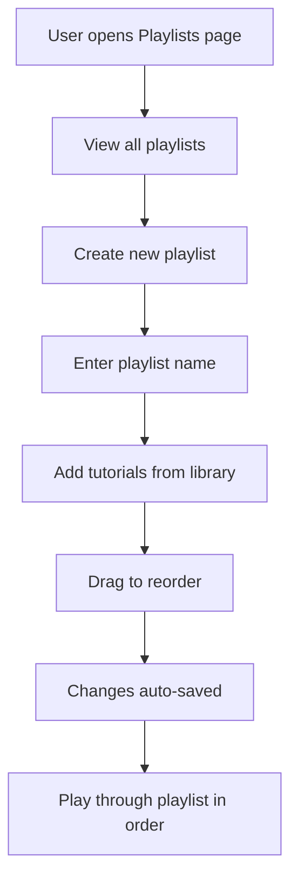
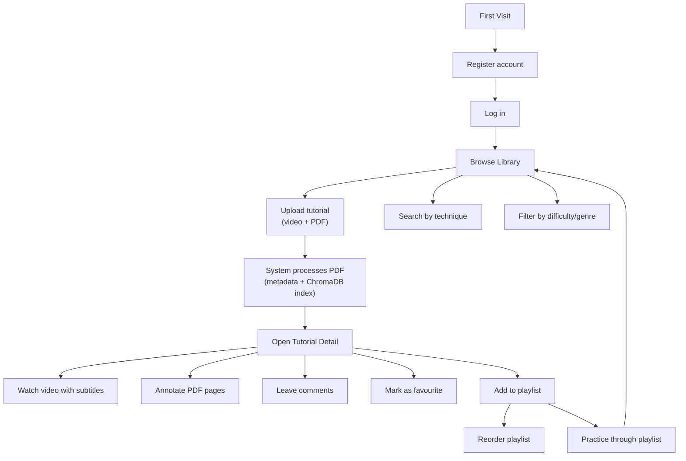

# Functional Documentation — Guitar Tutorial Manager

| Purpose | Audience | Status | Date |
|---------|----------|--------|------|
| User stories, feature descriptions, workflows, and acceptance criteria | Product owners, QA, developers | Draft | 2026-05-02 |

---

## 1. User Personas

### Primary Persona: The Practicing Guitarist

- **Name**: Alex
- **Goal**: Learn new songs efficiently using video lessons with tablature
- **Pain points**: Disorganised file collection, can't find specific techniques, no way to annotate PDFs
- **Needs**: Semantic search across tutorials, PDF annotations, video with subtitles, organised playlists

---

## 2. User Stories

### 2.1 Tutorial Management

#### US-01: Browse Tutorial Library

> **As a** guitarist, **I want to** see all my tutorials in a library view, **so that** I can quickly find and play a lesson.

**Acceptance Criteria**

- [ ] Library page displays all tutorial directories as cards
- [ ] Each card shows: name, difficulty, genre, tuning, techniques
- [ ] Cards indicate whether video, subtitles, and PDF tablature are available
- [ ] Empty state shown when no tutorials exist

**Workflow**

#### US-02: Create a New Tutorial

> **As a** teacher, **I want to** upload a video and PDF for a new song, **so that** I can add it to my collection.

**Acceptance Criteria**

- [ ] Authenticated user can create a tutorial with a unique ID
- [ ] Video file (mp4, mkv, webm, avi, mov) can be uploaded (max 500MB)
- [ ] PDF tablature file can be uploaded alongside the video
- [ ] Tutorial ID is sanitised (alphanumeric, hyphens, underscores only)
- [ ] Duplicate tutorial IDs are rejected with a clear error
- [ ] Response confirms which files were uploaded

**Workflow**

### 2.2 PDF & Metadata

#### US-03: Upload PDF and Extract Metadata

> **As a** guitarist, **I want to** upload a PDF tablature and have its metadata automatically extracted, **so that** I can search and filter by song attributes.

**Acceptance Criteria**

- [ ] PDF file upload triggers automatic text extraction
- [ ] Extracted text is sent to Ollama/Mistral for metadata extraction
- [ ] Extracted metadata includes: title, tuning, musical key, difficulty, techniques, genre
- [ ] Metadata is persisted and displayed on the tutorial detail page
- [ ] Text chunks are indexed into ChromaDB for semantic search
- [ ] Raw LLM response is stored for debugging

**Workflow**

#### US-04: Semantic Search Across Tutorials

> **As a** hobbyist, **I want to** search my tutorials using natural language, **so that** I can find lessons covering specific techniques or concepts.

**Acceptance Criteria**

- [ ] Search bar is available on the library page
- [ ] Query is sent to ChromaDB for vector similarity search
- [ ] Results include: tutorial name, matched text chunks, relevance score
- [ ] Results are ordered by relevance score (highest first)
- [ ] Empty query returns no results
- [ ] No results state is handled gracefully

**Workflow**

### 2.3 Video Playback

#### US-05: Stream Video with Subtitles

> **As a** guitarist, **I want to** watch tutorial videos with subtitles, **so that** I can follow along with the lesson.

**Acceptance Criteria**

- [ ] Video player supports HTTP range requests for efficient streaming
- [ ] Subtitles (SRT) are displayed when available
- [ ] Subtitles are generated asynchronously via Faster-Whisper if not present
- [ ] Video can be seeked to any position
- [ ] Player shows loading state while video buffers

**Workflow**

### 2.4 Annotations

#### US-06: Annotate PDF Pages

> **As a** guitarist, **I want to** add text notes, highlights, and drawings on PDF pages, **so that** I can mark important sections.

**Acceptance Criteria**

- [ ] User can create text annotations at specific positions on a PDF page
- [ ] User can highlight text regions with a colour
- [ ] User can underline text regions
- [ ] User can draw freeform strokes on the page
- [ ] Annotations persist across sessions
- [ ] Annotations can be updated and deleted

**Supported Annotation Types**

| Type | Description | Data |
|------|-------------|------|
| `text` | Text note at a position | `content` field |
| `highlight` | Highlighted region | `strokeData` (start/end points) + `color` |
| `underline` | Underlined region | `strokeData` (start/end points) + `color` |
| `drawing` | Freeform drawing | `strokeData` (array of points) + `color` |

### 2.5 Comments

#### US-07: Comment on Tutorials

> **As a** guitarist, **I want to** leave comments on tutorials, **so that** I can note my progress or questions.

**Acceptance Criteria**

- [ ] Comments can be created, read, updated, and deleted
- [ ] Comments display creation and last-updated timestamps
- [ ] Comment list is ordered by creation time

### 2.6 Playlists

#### US-08: Create and Manage Playlists

> **As a** teacher, **I want to** organise tutorials into playlists, **so that** I can create structured lesson plans.

**Acceptance Criteria**

- [ ] Playlists can be created with a name
- [ ] Tutorials can be added to a playlist
- [ ] Tutorials in a playlist can be reordered
- [ ] Tutorials can be removed from a playlist
- [ ] Playlists can be renamed and deleted
- [ ] Playlist view shows tutorials in order with their names

**Workflow**

### 2.7 Preferences

#### US-09: Per-Tutorial Preferences

> **As a** guitarist, **I want to** mark tutorials as favourites and set difficulty levels, **so that** I can track my progress.

**Acceptance Criteria**

- [ ] Each tutorial can be marked as favourite (toggle)
- [ ] Difficulty level can be set per tutorial
- [ ] Preferences persist across sessions

#### US-10: Global User Preferences

> **As a** guitarist, **I want to** set my global preferences (theme, pagination, filters), **so that** the app works the way I like.

**Acceptance Criteria**

- [ ] Authenticated user can set theme (light/dark)
- [ ] Default difficulty filter can be configured
- [ ] Default sort direction can be configured
- [ ] Items per page can be configured
- [ ] Preferences persist across sessions

### 2.8 Authentication

#### US-11: Register and Login

> **As a** guitarist, **I want to** create an account and log in, **so that** my preferences and annotations are saved.

**Acceptance Criteria**

- [ ] New users can register with username, email, and password
- [ ] Existing users can log in with username and password
- [ ] Authentication token is stored and sent with protected requests
- [ ] Unauthorised access to protected endpoints redirects to login
- [ ] Token expiration is handled gracefully

---

## 3. Complete User Journey

---

## 4. Feature Matrix

| Feature | Web (React) | iOS (SwiftUI) | Auth Required |
|---------|-------------|---------------|---------------|
| Browse library | ✅ | ✅ | No |
| View tutorial detail | ✅ | ✅ | No |
| Stream video | ✅ | ✅ | No |
| Upload tutorial | ✅ | ❌ | Yes |
| Upload PDF | ✅ | ❌ | No |
| Semantic search | ✅ | ✅ | No |
| Annotations (CRUD) | ✅ | ❌ | No |
| Comments (CRUD) | ✅ | ❌ | No |
| Per-tutorial preferences | ✅ | ✅ | No |
| Playlists (CRUD) | ✅ | ✅ | No |
| User preferences | ✅ | ✅ | Yes |
| Register / Login | ✅ | ✅ | No |
| Dark/Light theme | ✅ | ✅ | No |
